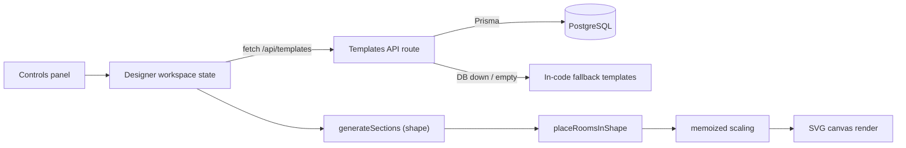

# Architex (ArchitectPro)

A full-stack Next.js floor-plan designer that generates parametric residential layouts — rectangular, L-, H-, and M-shaped — and renders them as SVG drawings with CAD-style annotations (dimension lines, north arrow, door swings, window and fixture symbols).

It is aimed at anyone who wants a quick, professional-looking 2D floor plan for a residential unit (Studio through 5BHK+, apartment through bungalow) without opening a CAD tool. Templates are served from PostgreSQL via Prisma, with hard-coded fallback templates so the app works with no database at all.

**Live demo:** [architect-pro.abacusai.app](https://architect-pro.abacusai.app)

## Architecture at a glance

- **Pattern:** a sequential client-side rendering pipeline — no agents, no LLM calls at runtime. One React workspace component (`designer-workspace.tsx`) drives: template fetch → section generation → room placement → proportional scaling → SVG render. Each stage is a pure function or memoized derivation; changing any input (BHK type, shape, dimensions) re-runs the stages downstream of it.
- **Frameworks:** Next.js 14 (App Router, API routes), React 18, TypeScript, Tailwind CSS + Radix UI (shadcn/ui), Prisma 6 on PostgreSQL.
- **State:** all design state is React component state in the browser (`useState`/`useMemo`). Nothing is persisted per user — the Prisma models for saved designs exist in the schema (`Design`, `Configuration`, `UserPreference`) but no route writes to them yet; the Save/Export buttons are rendered disabled.
- **Retrieval:** templates are fetched from `/api/templates` (Prisma `findMany` with optional `bhkType`/`propertyType` filters). If the database is unreachable or empty, the route silently serves two in-code fallback templates.



## Quickstart

```bash
git clone https://github.com/git-bonda108/architex-floorplan-designer.git
cd architex-floorplan-designer/nextjs_space

yarn install                # runs `prisma generate` via postinstall

cp .env.example .env        # set DATABASE_URL (optional — see below)

yarn prisma db push         # create tables (only if DATABASE_URL is set)
yarn prisma db seed         # seed 2BHK/3BHK templates (runs scripts/seed.ts)

yarn dev
```

Expected output: `next dev` reports `Ready` and serves `http://localhost:3000` — a landing page with a "Start Designing" button leading to `/designer`, which shows a controls panel on the left and the rendered floor plan on the right.

Without a database the app still runs: the templates route logs `Database not available, using fallback templates` and serves the built-in 2BHK and 3BHK layouts.

Note: `yarn prisma db seed` runs `scripts/seed.ts`, which seeds rooms only. `scripts/seed_new.ts` is the richer seed (doors, windows, fixtures, furniture) but is not wired into `package.json`; run it directly with `npx tsx --require dotenv/config scripts/seed_new.ts` if you want the full templates in the database.

## Configuration

| Variable | Required | Read by | Purpose / where to get it |
|---|---|---|---|
| `DATABASE_URL` | No (fallback templates used without it) | `prisma/schema.prisma` | PostgreSQL connection string, `sslmode=require` for cloud DBs. From your Postgres provider's dashboard (Supabase, Neon, Vercel Postgres). |
| `NEXTAUTH_URL` | No (defaults to `http://localhost:3000`) | `app/layout.tsx` | Site URL used for the page's `metadataBase` / Open Graph URLs. Despite the name, no auth flow consumes it. |
| `NEXT_DIST_DIR` | No | `next.config.js` | Override for the Next.js build output directory. |
| `NEXT_OUTPUT_MODE` | No | `next.config.js` | Next.js `output` mode (e.g. `standalone`) for deployment targets that need it. |

`.env.example` also lists `OPENAI_API_KEY`, `DEEPSEEK_API_KEY`, `GROQ_API_KEY`, and `GEMINI_API_KEY`. No code in this repository reads them; they are placeholders for planned features and can be omitted.

## API

- `GET /api/templates?bhkType=2BHK&propertyType=Apartment` — returns a JSON **array** of template objects (both query parameters optional). Falls back to in-code templates on database failure.
- `GET /api/templates/{bhkType}` — returns the most recently created template for that BHK type, `404` if none exists. This path parameter is a BHK type (e.g. `2BHK`), not a template id.

## Documentation

- [docs/ARCHITECTURE.md](./docs/ARCHITECTURE.md) — component map, data flow, orchestration and state analysis, design trade-offs.
- [docs/EVALUATION.md](./docs/EVALUATION.md) — current test reality and a proposed evaluation harness.
- [docs/HARDENING.md](./docs/HARDENING.md) — security posture and a staged path to production.
- [SHAPE_IMPLEMENTATION.md](./SHAPE_IMPLEMENTATION.md) and [SHAPE_LAYOUT_LOGIC.md](./SHAPE_LAYOUT_LOGIC.md) — shape layout algorithm notes.
- [BACKEND_ARCHITECTURE.md](./BACKEND_ARCHITECTURE.md), [VERCEL_DEPLOYMENT.md](./VERCEL_DEPLOYMENT.md), [SUPABASE_CONNECTION_GUIDE.md](./SUPABASE_CONNECTION_GUIDE.md), [API_KEYS_SETUP.md](./API_KEYS_SETUP.md) — earlier setup/deployment guides.
- [CONTRIBUTING.md](./CONTRIBUTING.md) — contributor guidelines.

## Project structure

```
nextjs_space/
├── app/
│   ├── api/templates/          # GET list + GET by BHK type (Prisma, with fallback)
│   ├── designer/               # Designer page and its private components
│   │   └── _components/        # designer-workspace, controls-panel, floor-plan-canvas
│   ├── layout.tsx              # Root layout, metadata
│   └── page.tsx                # Landing page
├── components/ui/              # shadcn/ui primitives
├── lib/
│   ├── types.ts                # Room/Door/Window/Fixture/Furniture/Template types
│   ├── shape-layout-utils.ts   # Section generation + room placement per shape
│   ├── floor-plan-utils.ts     # Area, bounds, unit conversion, room colors
│   ├── architectural-symbols.ts# SVG generators: doors, windows, fixtures, north arrow, dimension lines
│   └── db.ts                   # Prisma client singleton
├── prisma/schema.prisma        # Template, Design, Configuration, UserPreference
└── scripts/                    # seed.ts (wired), seed_new.ts (richer, manual)
```

## Current limitations

- Save and Export are visible in the UI but disabled; no design persistence exists yet.
- There is no automated test suite (see [docs/EVALUATION.md](./docs/EVALUATION.md)).
- The BHK/property-type selector drives template fetching, but the shape selector generates a fixed four-room program (Living Room, Kitchen, Maid's Room, Garage) independent of the selected BHK type.
- No license file is present in the repository.
